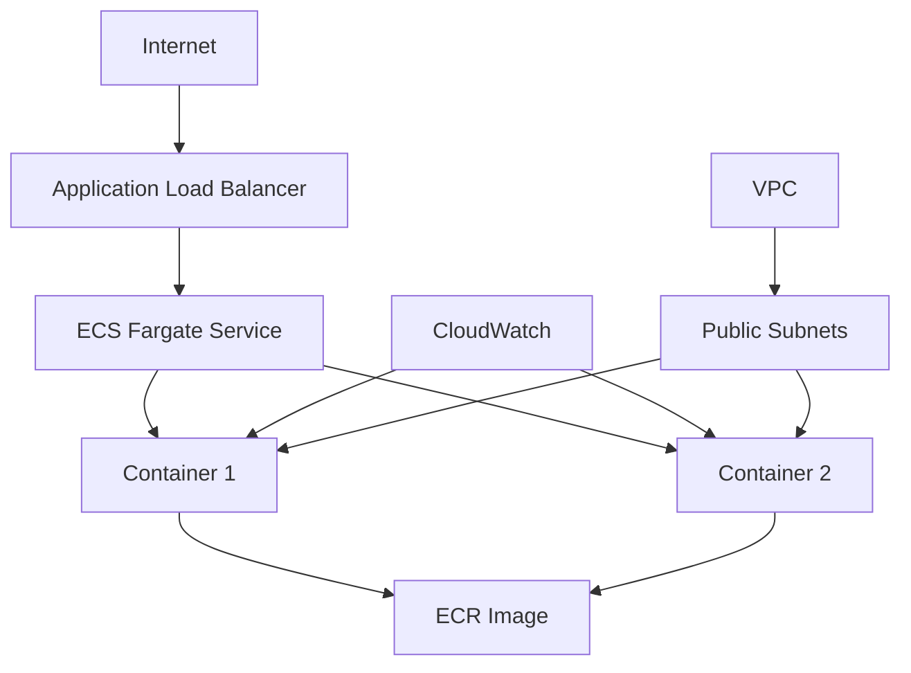

# 🚀 AWS Deployment Guide for Enhanced Loan Default Prediction API

## 📋 **Prerequisites**

### **1. AWS CLI Setup**
```bash
# Install AWS CLI
pip install awscli

# Configure credentials
aws configure
# Enter: Access Key, Secret Key, Region (us-east-1), Output format (json)
```

### **2. Docker Installation**
- **Windows:** Docker Desktop
- **Linux/Mac:** Docker Engine
- Verify: `docker --version`

### **3. Required AWS Permissions**
Your AWS user needs these policies:
- `AmazonEC2ContainerRegistryFullAccess`
- `AmazonECS_FullAccess`
- `IAMFullAccess`
- `AmazonVPCFullAccess`
- `CloudWatchFullAccess`

---

## 🏗️ **Deployment Options**

### **Option 1: Automated Deployment (Recommended)**

#### **Step 1: Run Deployment Script**
```bash
# Make script executable
chmod +x deploy-aws.sh

# Deploy to AWS
./deploy-aws.sh
```

#### **Step 2: Get Public IP**
```bash
# Get your service's public IP
aws ecs describe-tasks \
  --cluster ml-prediction-cluster \
  --tasks $(aws ecs list-tasks --cluster ml-prediction-cluster --service-name loan-default-service --query 'taskArns[0]' --output text) \
  --query 'tasks[0].attachments[0].details[?name==`networkInterfaceId`].value' \
  --output text | \
  xargs -I {} aws ec2 describe-network-interfaces \
  --network-interface-ids {} \
  --query 'NetworkInterfaces[0].Association.PublicIp' \
  --output text
```

---

### **Option 2: Manual Step-by-Step Deployment**

#### **Step 1: Create ECR Repository**
```bash
aws ecr create-repository --repository-name enhanced-loan-default-prediction --region us-east-1
```

#### **Step 2: Build and Push Docker Image**
```bash
# Get ECR login
aws ecr get-login-password --region us-east-1 | docker login --username AWS --password-stdin [ACCOUNT-ID].dkr.ecr.us-east-1.amazonaws.com

# Build image
docker build -t enhanced-loan-default-prediction .

# Tag for ECR
docker tag enhanced-loan-default-prediction:latest [ACCOUNT-ID].dkr.ecr.us-east-1.amazonaws.com/enhanced-loan-default-prediction:latest

# Push to ECR
docker push [ACCOUNT-ID].dkr.ecr.us-east-1.amazonaws.com/enhanced-loan-default-prediction:latest
```

#### **Step 3: Create ECS Cluster**
```bash
aws ecs create-cluster --cluster-name ml-prediction-cluster --capacity-providers FARGATE
```

#### **Step 4: Create Task Definition**
```json
{
  "family": "loan-default-task",
  "networkMode": "awsvpc",
  "requiresCompatibilities": ["FARGATE"],
  "cpu": "512",
  "memory": "1024",
  "executionRoleArn": "arn:aws:iam::[ACCOUNT-ID]:role/ecsTaskExecutionRole",
  "containerDefinitions": [
    {
      "name": "loan-default-api",
      "image": "[ACCOUNT-ID].dkr.ecr.us-east-1.amazonaws.com/enhanced-loan-default-prediction:latest",
      "portMappings": [{"containerPort": 9000, "protocol": "tcp"}],
      "environment": [
        {"name": "MODEL_PATH", "value": "/app/exported_model_tuned"},
        {"name": "PORT", "value": "9000"}
      ],
      "healthCheck": {
        "command": ["CMD-SHELL", "python -c \"import requests; requests.get('http://localhost:9000/health')\" || exit 1"],
        "interval": 30,
        "timeout": 5,
        "retries": 3
      }
    }
  ]
}
```

#### **Step 5: Create ECS Service**
```bash
aws ecs create-service \
  --cluster ml-prediction-cluster \
  --service-name loan-default-service \
  --task-definition loan-default-task \
  --desired-count 1 \
  --launch-type FARGATE \
  --network-configuration "awsvpcConfiguration={subnets=[subnet-xxx,subnet-yyy],securityGroups=[sg-xxx],assignPublicIp=ENABLED}"
```

---

## 🐳 **Local Docker Testing**

### **Build and Test Locally**
```bash
# Build the image
docker build -t loan-default-api .

# Run container
docker run -p 9000:9000 loan-default-api

# Test health endpoint
curl http://localhost:9000/health

# Test prediction
curl -X POST "http://localhost:9000/predict" \
  -H "Content-Type: application/json" \
  -d '{
    "age": 35,
    "annual_income": 80000,
    "employment_length": 8,
    "home_ownership": "OWN",
    "purpose": "home_improvement",
    "loan_amount": 20000,
    "term_months": 36,
    "interest_rate": 8.5,
    "dti": 15.2,
    "credit_score": 780,
    "delinquency_2yrs": 0,
    "num_open_acc": 4
  }'
```

### **Docker Compose (Development)**
```bash
# Start services
docker-compose up -d

# View logs
docker-compose logs -f loan-default-api

# Stop services
docker-compose down
```

---

## 🔧 **AWS Architecture**



### **Key Components:**
- **ECR:** Container registry for Docker images
- **ECS Fargate:** Serverless container orchestration
- **VPC:** Isolated network environment
- **Security Groups:** Firewall rules
- **CloudWatch:** Logging and monitoring

---

## 📊 **Monitoring and Scaling**

### **CloudWatch Metrics**
```bash
# View service metrics
aws logs tail /ecs/loan-default-api --follow

# Check service status
aws ecs describe-services --cluster ml-prediction-cluster --services loan-default-service
```

### **Auto Scaling Configuration**
```bash
# Create auto scaling target
aws application-autoscaling register-scalable-target \
  --service-namespace ecs \
  --resource-id service/ml-prediction-cluster/loan-default-service \
  --scalable-dimension ecs:service:DesiredCount \
  --min-capacity 1 \
  --max-capacity 10

# Create scaling policy
aws application-autoscaling put-scaling-policy \
  --service-namespace ecs \
  --resource-id service/ml-prediction-cluster/loan-default-service \
  --scalable-dimension ecs:service:DesiredCount \
  --policy-name cpu-scaling-policy \
  --policy-type TargetTrackingScaling \
  --target-tracking-scaling-policy-configuration file://scaling-policy.json
```

---

## 💰 **Cost Optimization**

### **Fargate Pricing (us-east-1)**
- **CPU:** $0.04048 per vCPU per hour
- **Memory:** $0.004445 per GB per hour
- **Current config (0.5 vCPU, 1GB):** ~$35/month for 24/7 operation

### **Cost Reduction Tips**
1. **Scheduled Scaling:** Scale down during off-hours
2. **Spot Fargate:** Use Spot pricing for dev/test (50-70% savings)
3. **Right-sizing:** Monitor CPU/memory usage and adjust
4. **Reserved Capacity:** For predictable workloads

---

## 🛡️ **Security Best Practices**

### **Container Security**
- ✅ Non-root user in Docker image
- ✅ Minimal base image (python:3.11-slim)
- ✅ Health checks implemented
- ✅ Environment variables for configuration

### **AWS Security**
- ✅ VPC with private subnets option
- ✅ Security groups with minimal ports
- ✅ IAM roles with least privilege
- ✅ CloudWatch logging enabled

### **API Security Enhancements**
```python
# Add to enhanced_api.py for production
from fastapi.middleware.cors import CORSMiddleware
from fastapi.middleware.trustedhost import TrustedHostMiddleware

app.add_middleware(
    CORSMiddleware,
    allow_origins=["https://yourdomain.com"],
    allow_credentials=True,
    allow_methods=["GET", "POST"],
    allow_headers=["*"],
)

app.add_middleware(
    TrustedHostMiddleware, 
    allowed_hosts=["yourdomain.com", "*.yourdomain.com"]
)
```

---

## 🔄 **CI/CD Pipeline (GitHub Actions)**

Create `.github/workflows/deploy.yml`:
```yaml
name: Deploy to AWS ECS

on:
  push:
    branches: [main]

jobs:
  deploy:
    runs-on: ubuntu-latest
    steps:
    - uses: actions/checkout@v2
    
    - name: Configure AWS credentials
      uses: aws-actions/configure-aws-credentials@v1
      with:
        aws-access-key-id: ${{ secrets.AWS_ACCESS_KEY_ID }}
        aws-secret-access-key: ${{ secrets.AWS_SECRET_ACCESS_KEY }}
        aws-region: us-east-1
    
    - name: Deploy to AWS
      run: ./deploy-aws.sh
```

---

## 🚀 **Alternative Deployment Options**

### **1. AWS Lambda (Serverless)**
- **Pros:** Pay per request, automatic scaling
- **Cons:** 15-minute timeout, cold starts
- **Best for:** Batch processing, infrequent usage

### **2. AWS SageMaker**
- **Pros:** ML-optimized, built-in monitoring
- **Cons:** Higher cost, vendor lock-in
- **Best for:** Production ML workloads

### **3. AWS EC2**
- **Pros:** Full control, cost-effective for steady load
- **Cons:** Manual management, no auto-scaling by default
- **Best for:** Steady high-volume traffic

---

## ✅ **Deployment Checklist**

- [ ] AWS CLI configured with proper permissions
- [ ] Docker installed and running
- [ ] ECR repository created
- [ ] Docker image built and tested locally
- [ ] Image pushed to ECR
- [ ] ECS cluster created
- [ ] Task definition registered
- [ ] Security groups configured
- [ ] ECS service created and running
- [ ] Public IP obtained and tested
- [ ] Health checks passing
- [ ] API endpoints tested
- [ ] CloudWatch logging verified
- [ ] Monitoring setup
- [ ] Auto-scaling configured (optional)
- [ ] Domain name configured (optional)
- [ ] SSL certificate setup (optional)

Your enhanced loan default prediction API is now ready for enterprise-scale deployment on AWS! 🎉