# 🏦 Enhanced Loan Default Prediction System

**Advanced ML Pipeline with 94.64% ROC-AUC & 88.24% Precision**

A production-ready machine learning system for loan default prediction using MLflow, FastAPI, and advanced feature engineering. This system transforms raw loan application data into intelligent risk assessments with comprehensive business recommendations.

## 🚀 **Key Achievements**

✅ **Exceeds Performance Targets:** 94.64% ROC-AUC (target: >85%), 88.24% Precision (target: >80%)  
✅ **Advanced Feature Engineering:** 26 total features including 14 derived risk indicators  
✅ **Production API:** FastAPI with <50ms response time and batch processing  
✅ **Model Optimization:** Comprehensive hyperparameter tuning across 4 algorithms  
✅ **Business Intelligence:** Detailed risk assessments and approval recommendations

## 🎯 **System Architecture**

```mermaid
graph TB
    A[Loan Application Data] --> B[Feature Engineering Pipeline]
    B --> C[Enhanced Features 26 total]
    C --> D[Model Training MLflow]
    D --> E[Hyperparameter Optimization]
    E --> F[Best Model: Gradient Boosting]
    F --> G[FastAPI Production Server]
    G --> H[Risk Assessment & Recommendations]
    
    subgraph "ML Models Tested"
        I[Logistic Regression]
        J[Random Forest]
        K[Gradient Boosting ⭐]
        L[SVM]
    end
```



## 📊 **Model Performance**

| Model | ROC-AUC | Precision | Recall | F1-Score | Status |
|-------|---------|-----------|--------|----------|---------|
| **Gradient Boosting** | **94.64%** | **88.24%** | 79.31% | 83.56% | ✅ **Selected** |
| Random Forest | 94.35% | 78.95% | 83.33% | 81.08% | ✅ Excellent |
| Logistic Regression | 89.39% | 68.18% | 88.89% | 77.27% | ✅ Good |
| SVM | 89.16% | 0.00% | 0.00% | 0.00% | ❌ Poor |

## 📊 Data Description

**Dataset**: `loan_default_sample.csv` with the following features:
- `loan_id`: Unique loan identifier
- `age`: Age of the applicant
- `annual_income`: Annual income of the applicant
- `employment_length`: Employment duration in years
- `home_ownership`: Type of home ownership (OWN, RENT, MORTGAGE)
- `purpose`: Purpose of the loan (debt_consolidation, credit_card, etc.)
- `loan_amount`: Total loan amount
- `term_months`: Repayment term in months
- `interest_rate`: Interest rate for the loan
- `dti`: Debt-to-income ratio
- `credit_score`: Applicant's credit score
- `delinquency_2yrs`: Number of delinquencies in past 2 years
- `num_open_acc`: Number of open accounts
- `target_default`: Binary flag (1 = Default, 0 = Non-default)

## 🔧 **Enhanced Feature Engineering**

### **Original Features (12)**
- Basic demographics and loan details
- Credit score, income, employment history
- Debt-to-income ratio, delinquencies

### **Derived Features (14)**
- **Financial Ratios:** Income-to-loan, payment-to-income ratios
- **Risk Scoring:** Employment risk, high interest flags
- **Behavioral Indicators:** Young borrower, multiple delinquencies
- **Credit Categories:** Excellent/Good/Fair/Poor classifications
- **Payment Analysis:** Monthly payment calculations

## 🚀 **Quick Start**

### **🐳 Docker Hub (Recommended)**
```bash
# Pull and run from Docker Hub
docker run -d -p 9000:9000 asbhoskar/enhanced-loan-default-prediction:latest

# Test the API
curl http://localhost:9000/health
```

### **📋 Local Development Setup**
```bash
# Clone repository
git clone https://github.com/asbhosekar/enhanced-loan-default-prediction.git
cd enhanced-loan-default-prediction

# Create virtual environment
python -m venv .venv
.venv\Scripts\activate  # Windows
# source .venv/bin/activate  # Linux/Mac

# Install dependencies
pip install -r requirements.txt
```

### **🎯 Model Training (Optional)**
```bash
# Basic training
python train.py --model-type logistic

# Advanced hyperparameter tuning
python advanced_train.py
```

### **🚀 API Server**
```bash
# Option 1: Docker (Recommended)
docker run -p 9000:9000 asbhoskar/enhanced-loan-default-prediction:latest

# Option 2: Local development
$env:MODEL_PATH="./exported_model_tuned"  # Windows
# export MODEL_PATH="./exported_model_tuned"  # Linux/Mac
python enhanced_api.py
```

### **🧪 API Testing**
```bash
# Health check
curl http://localhost:9000/health

# Test prediction
curl -X POST "http://localhost:9000/predict" \
  -H "Content-Type: application/json" \
  -d '{
    "age": 35,
    "annual_income": 80000,
    "employment_length": 8,
    "home_ownership": "OWN",
    "purpose": "home_improvement",
    "loan_amount": 20000,
    "term_months": 36,
    "interest_rate": 8.5,
    "dti": 15.2,
    "credit_score": 780,
    "delinquency_2yrs": 0,
    "num_open_acc": 4
  }'
```

## 🐳 **Docker Hub**

**Image:** [`asbhoskar/enhanced-loan-default-prediction`](https://hub.docker.com/r/asbhoskar/enhanced-loan-default-prediction)

### **Available Tags:**
- `latest` - Most recent stable version
- `v2.1` - Enhanced features with 94.64% ROC-AUC
- `v2.0` - Initial production release

### **Quick Commands:**
```bash
# Pull latest image
docker pull asbhoskar/enhanced-loan-default-prediction:latest

# Run with Docker Compose
curl -O https://raw.githubusercontent.com/asbhosekar/enhanced-loan-default-prediction/main/docker-compose.yml
docker-compose up -d
```

## 📚 **API Documentation**

### **Endpoints**

| Endpoint | Method | Description |
|----------|---------|-------------|
| `/health` | GET | System health and model status |
| `/model-info` | GET | Detailed model performance metrics |
| `/predict` | POST | Single loan application prediction |
| `/batch-predict` | POST | Multiple applications processing |

### **Example Response**
```json
{
  "prediction": {
    "default_probability": 0.0505,
    "default_probability_percent": "5.05%",
    "binary_prediction": 0,
    "prediction_label": "No Default"
  },
  "risk_assessment": {
    "risk_level": "Very Low",
    "risk_color": "green",
    "confidence": "High"
  },
  "recommendation": {
    "decision": "Approve",
    "reasoning": "Based on 5.05% default probability and very low risk level"
  },
  "feature_analysis": {
    "income_to_loan_ratio": 4.0,
    "monthly_payment": 555.56,
    "payment_to_income_ratio": 0.0833,
    "risk_score": 0,
    "credit_score_category": "Excellent"
  }
}
```

## 🧪 **Testing**

### **Comprehensive Test Suite**
```bash
# Model validation
python final_validation.py

# API testing
python test_enhanced_api.py

# Postman testing
# See POSTMAN_TESTING_GUIDE.md for detailed instructions
```

### **Test Coverage**
- ✅ Model accuracy validation
- ✅ Feature engineering verification
- ✅ API endpoint testing
- ✅ Edge case handling
- ✅ Performance benchmarking

## �📁 **Project Structure**

```
mlflow_loan_default_pipeline-1/
├── 📊 Data & Training
│   ├── loan_default_sample.csv     # Sample dataset
│   ├── train.py                    # Basic training script
│   ├── advanced_train.py           # Hyperparameter optimization
│   └── hyperparameter_search.py    # Search utilities
├── 🚀 Production API
│   ├── enhanced_api.py             # Production FastAPI server
│   └── predict_api/
│       ├── app.py                  # Basic API
│       └── Dockerfile              # Container deployment
├── 🤖 Trained Models
│   ├── exported_model/             # Basic model artifacts
│   └── exported_model_tuned/       # Optimized model artifacts
├── 🧪 Testing & Validation
│   ├── final_validation.py         # Comprehensive validation
│   ├── test_enhanced_api.py        # API testing
│   └── simple_test.py             # Basic model testing
├── 📚 Documentation
│   ├── README.md                   # This file
│   ├── POSTMAN_TESTING_GUIDE.md   # API testing guide
│   └── EDA_LinearRegression_Detailed.ipynb  # Analysis notebook
└── ⚙️ Configuration
    ├── requirements.txt            # Dependencies
    ├── conda.yaml                 # Conda environment
    ├── MLproject                  # MLflow configuration
    └── .gitignore                 # Git ignore rules
```

## 🎯 **Business Impact**

### **Risk Assessment Categories**
- **Very Low (0-10%):** ✅ Auto-approve with standard terms
- **Low (10-25%):** ✅ Approve with enhanced monitoring
- **Medium (25-50%):** ⚠️ Manual review required
- **High (50-75%):** ❌ Reject or require additional collateral
- **Very High (75%+):** ❌ Auto-reject

### **Key Business Metrics**
- **False Positive Rate:** 11.76% (minimizes good loan rejections)
- **False Negative Rate:** 20.69% (controls bad loan approvals)
- **Expected ROI:** Significant improvement in loan portfolio quality
- **Processing Speed:** <50ms per application

## 🔄 **MLflow Integration**

### **Experiment Tracking**
- Automated metric logging (ROC-AUC, precision, recall)
- Model artifact storage and versioning
- Parameter tracking for reproducibility
- Performance comparison across runs

### **Model Registry**
- Production model deployment
- A/B testing capabilities
- Model rollback functionality
- Version control and governance

## 🐳 **Deployment Options**

### **🎯 Docker Hub (Production Ready)**
```bash
# Single container
docker run -d -p 9000:9000 --name loan-api asbhoskar/enhanced-loan-default-prediction:latest

# With Docker Compose
docker-compose up -d

# Health check
curl http://localhost:9000/health
```

### **☁️ Cloud Deployment**
```bash
# AWS ECS Fargate (automated)
./deploy-aws.sh

# Kubernetes
kubectl apply -f k8s-deployment.yaml

# Manual deployment guide
# See AWS_DEPLOYMENT_GUIDE.md for detailed instructions
```

### **💻 Local Development**
```bash
python enhanced_api.py
```

## 🛠 **Technology Stack**

| Component | Technology | Version |
|-----------|------------|---------|
| **ML Framework** | scikit-learn | 1.1+ |
| **Experiment Tracking** | MLflow | 2.0+ |
| **API Framework** | FastAPI | 0.100+ |
| **Data Processing** | pandas, numpy | Latest |
| **Model Optimization** | RandomizedSearchCV | - |
| **Validation** | cross-validation | - |
| **Deployment** | Uvicorn, Docker | Latest |

## 📈 **Performance Benchmarks**

| Metric | Target | Achieved | Status |
|--------|--------|----------|---------|
| ROC-AUC | >85% | **94.64%** | ✅ Exceeded |
| Precision | >80% | **88.24%** | ✅ Exceeded |
| Response Time | <100ms | <50ms | ✅ Exceeded |
| Accuracy | >85% | 91.0% | ✅ Exceeded |

## 🤝 **Contributing**

1. Fork the repository
2. Create a feature branch (`git checkout -b feature/amazing-feature`)
3. Commit your changes (`git commit -m 'Add amazing feature'`)
4. Push to the branch (`git push origin feature/amazing-feature`)
5. Open a Pull Request

## 📄 **License**

This project is licensed under the MIT License - see the [LICENSE](LICENSE) file for details.

## 🙋‍♂️ **Support**

For questions and support:
- 📧 Create an issue in this repository
- 📚 Review the [POSTMAN_TESTING_GUIDE.md](POSTMAN_TESTING_GUIDE.md) for API testing
- 🔍 Check the MLflow UI for experiment details

---

**Built with ❤️ for intelligent loan decision making**
- `train.py` - Train Logistic Regression/Random Forest model, log to MLflow, export to `exported_model/`
- `predict_api/` - FastAPI app and Dockerfile to serve loan default predictions
- `test_model.py` - Test script for API validation
- `loan_default_sample.csv` - Loan dataset with borrower information
- `requirements.txt` - Python dependencies for training
- `predict_api/requirements.txt` - Dependencies for the API

---

## 🚀 Quick Start (Local)

### 1) Create a virtual environment and install dependencies
```bash
python -m venv .venv
# On Windows:
.venv\Scripts\activate
# On Linux/Mac:
source .venv/bin/activate

pip install -r requirements.txt
```

### 2) Start MLflow tracking server (recommended)
```bash
mlflow server \
  --backend-store-uri sqlite:///mlflow.db \
  --default-artifact-root ./mlruns \
  --host 0.0.0.0 \
  --port 5000
```
Open MLflow UI at: http://127.0.0.1:5000

### 3) Train the loan default prediction model
Basic training with Logistic Regression:
```bash
python train.py
```

Train with hyperparameter tuning:
```bash
python train.py --tune --model-type logistic
```

Train Random Forest with tuning:
```bash
python train.py --model-type random_forest --tune
```

### 4) Serve the loan default prediction model

#### Option A — Run the FastAPI app locally
```bash
# Set environment variable for model path
set MODEL_PATH=./exported_model

# Install API dependencies
pip install -r predict_api/requirements.txt

# Start the API server
uvicorn predict_api.app:app --host 0.0.0.0 --port 9000
```

#### Option B — Use Docker
```bash
# Build the Docker image
docker build -f predict_api/Dockerfile -t loan-default-api .

# Run the container
docker run -p 9000:9000 loan-default-api
```

### 5) Test the API
```bash
# Test health endpoint
curl http://localhost:9000/health

# Test prediction endpoint
curl -X POST "http://localhost:9000/predict" \
     -H "Content-Type: application/json" \
     -d '{
       "age": 32,
       "annual_income": 60000,
       "employment_length": 3,
       "home_ownership": "RENT",
       "purpose": "credit_card",
       "loan_amount": 15000,
       "term_months": 36,
       "interest_rate": 12.5,
       "dti": 20.3,
       "credit_score": 720,
       "delinquency_2yrs": 0,
       "num_open_acc": 6
     }'
```

Or run the test script:
```bash
python test_model.py
```

## 📊 Model Evaluation Metrics

The model tracks the following classification metrics:
- **Accuracy**: Overall correctness of predictions
- **Precision**: True positives / (True positives + False positives)
- **Recall**: True positives / (True positives + False negatives)
- **F1-Score**: Harmonic mean of precision and recall
- **ROC-AUC**: Area under the ROC curve

**Success Criteria**: AUC > 0.85, Precision > 0.8

## 🔌 API Endpoints

### GET /health
Returns model load status and service information.

**Response:**
```json
{
  "status": "ok",
  "model_loaded": true,
  "model_path": "./exported_model",
  "service": "Loan Default Prediction API"
}
```

### POST /predict
Predicts loan default probability for a single application.

**Request Body:**
```json
{
  "age": 32,
  "annual_income": 60000,
  "employment_length": 3,
  "home_ownership": "RENT",
  "purpose": "credit_card",
  "loan_amount": 15000,
  "term_months": 36,
  "interest_rate": 12.5,
  "dti": 20.3,
  "credit_score": 720,
  "delinquency_2yrs": 0,
  "num_open_acc": 6
}
```

**Response:**
```json
{
  "default_probability": 0.1234,
  "binary_prediction": 0,
  "risk_level": "Low",
  "recommendation": "Approve"
}
```
            "hire_date": "2015-06-01",
            "certifications": 2
        }
    ]
}
```
Response:
```json
{
    "predictions": [
        75211.12961613911
    ]
}
```

---

## Fine-tuning / Hyperparameter search

There are two example approaches included:

1. **Grid search inside `train.py`** (use `--tune` with `--alpha ...`): uses `GridSearchCV` and logs the best params & model to MLflow.

2. **Randomized search example**: `python hyperparameter_search.py --data-path sample_input_for_regression.csv --target <TARGET> --n-iter 20`

### Tips for larger sweeps
- Use `RandomizedSearchCV` or `Optuna` for large parameter spaces.
- Run experiments in parallel (multiple machines or use MLflow to track).
- Use MLflow's `mlflow.sklearn.autolog()` for auto-logging during quick experiments.
- Consider saving intermediate artifacts (example predictions, feature importance).

---

## Notes & Next steps
- You can configure `MLFLOW_TRACKING_URI` env var or pass `--mlflow-tracking-uri` to `train.py` to point to a remote MLflow server.
- To register models in MLflow Model Registry, run a tracking server and pass `--register-model <ModelName>` to `train.py`.
- The exported model is an MLflow-compatible model — it can be served with `mlflow models serve` or loaded using `mlflow.sklearn.load_model`.

---
## Docker run

```
docker build -t ml-predict-api:latest -f predict_api/Dockerfile .


docker run --rm -p 9000:9000 `
  -e MODEL_PATH=/app/exported_model `
  -e MLFLOW_TRACKING_URI=http://host.docker.internal:5000 `
  -v "${PWD}\exported_model:/app/exported_model:ro" `
  --name ml-predict-api ml-predict-api:latest

```
## Run model

```
http://127.0.0.1:9000/predict
```
```json
{
    "records": [
        {
            "id": 102,
            "age": 35,
            "years_experience": 10,
            "department": "Sales",
            "education": "Bachelors",
            "education_level": "Undergraduate",
            "performance_score": 5.2,
            "remote_work_pct": 20,
            "bonus": 5000,
            "hire_date": "2015-06-01",
            "certifications": 2
        }
    ]
}
```
## Output

```
{
    "predictions": [
        77211.19380808137
    ]
}
```

## Model versioning
- Run the model with different input data, experiment_name, parameter or model_type
- Register this model of new experiment with existing registered model. Version will change automatically

```
python train.py --data-path sample_input_for_regression.csv --target salary --experiment-name LinearRegression_V2

```
